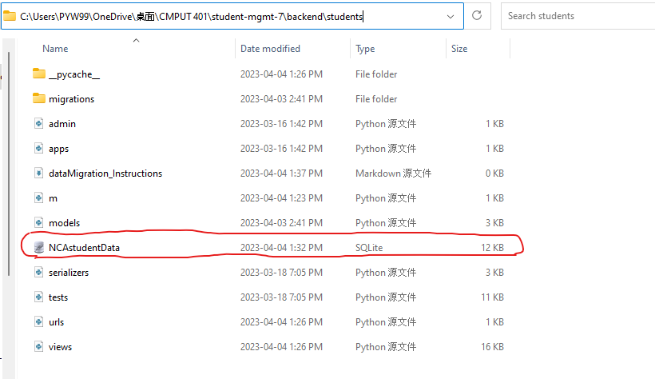

# Data Migration Instructions:
This page includes a short instruction of migrating previous data(student's data) to the new database.
The columns *FirstName, LastName, ChineseName, Address, City, Province, PostalCode, DoB, Gender, MedicalHistory, Remark, RegisterDate* will be migrated. FOIP and Approved will be set to true, and disabled will be false.


1. Move the previous sqlite3 database file under backend/students folder(path shown in image). Make sure to rename the database file to NCAstudentData.
[](images/datamigration-path.png)

2. Go to (websitePrefixs)/api/students/migrateData   
You can directly go to the website or send a GET request to it and if it is successful, it will say "data migrated".

3. Go the file students/urls.py and delete the line: 
```"path('students/migrateData', dataMigration ,name='MigrateData '),"```

4. Delete the previous sqlite3 database file, as it is no longer needed.