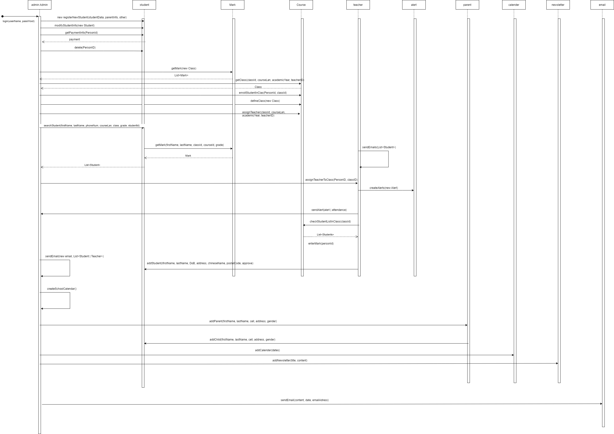

# Software Design

This page includes a short description of the overall architecture style of the system, its high-level system components, and their logical (what data they exchange) and control (how they invoke each other) dependencies.

## Architecture Diagram

This is a short description of the architecture.

## UML Class Diagram

This is a short description of logical entities of the domain in a UML diagram.

## Sequence Diagrams

This is a short description of the sequence diagram.

## Low-Fidelity User interface

This is a short description of the Low-Fidelity user interface, which shows a basic overview with the high level functionality of the user interface.

## API Documentation

The documentation can be viewed locally at [http://localhost:3000/api/docs/](http://localhost:3000/api/docs/).

