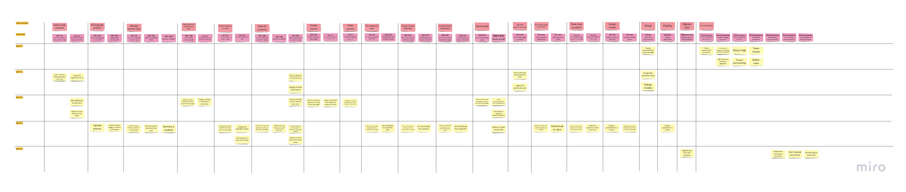

# Project Management

This page provides a general overview of the assigned tasks and roles for the duration of five sprints (subject to change).

## Story Map

#### View it directly on miro: [https://miro.com/app/board/uXjVPuP1C3I=/?share_link_id=444592371892](https://miro.com/app/board/uXjVPuP1C3I=/?share_link_id=444592371892)

---

## Project Plan

### Sprint 1
_Due: January 28_

#### Tasks
| **Task**                        | **Related US** | **Assigned To**     | **Due Date** |
| ------------------------------- | -------------- | ------------------- | ------------ |
| Project requirement document    | Documentation  | Everyone            | Jan 27       |
| Architecture diagram            | Documentation  | Everyone            | Jan 27       |
| Low fidelity wireframe diagram  | Documentation  | Everyone            | Jan 27       | 
| UML class diagram               | Documentation  | Param               | Jan 27       |
| UML sequence diagram            | Documentation  | Yanlin              | Jan 27       |
| Project plan                    | Documentation  | Emmanuel            | Jan 27       |
| Story map                       | Documentation  | Emmanuel            | Jan 27       |
| Backlog                         | Documentation  | David               | Jan 27       |
| Team canvas                     | Documentation  | Zhixuan             | Jan 27       |
| Belbin roles                    | Documentation  | Zhixuan             | Jan 27       |
| Deploy github pages             | Setup          | William             | Jan 27       |

---

### Sprint 2
_Due: February 11_

#### User stories
| **User story**                             | **Story points** |
| ------------------------------------------ | ---------------- |
| Setup - Set up dev environment             | 3                |
| AD 1.01/1.05 - Input/Modify Student Data   | 3                |
| AD 1.08 - View Student Data                | 1                |
| AD 6.01 - Admin Authentication             | 3                |

Estimated sprint velocity: 0.9 (9/10) (Estimated completed story points / Total assigned story points for this sprint)

#### Tasks
| **Task**                                           | **Related US** | **Assigned To**     | **Due Date** |
| -------------------------------------------------- | -------------- | ------------------- | ------------ |
| Create Django models                               | Setup          | Param               | Feb 10       |
| PostgreSQL database setup                          | Setup          | Param               | Feb 10       |
| Create student                                     | AD 1.01        | Zhixuan/Emmanuel    | Feb 10       |
| Remove/Modify student                              | AD 1.05        | David               | Feb 10       |
| Display student information                        | AD 1.08        | Yanlin              | Feb 10       |
| Admin authentication                               | AD 6.01        | William             | Feb 10       |

---

### Sprint 3
_Due: March 4_

#### User stories
| **User story**                               | **Story points** |
| -------------------------------------------- | ---------------- |
| AD 1.08 - View Student Data                  | 3                |
| AD 1.01/1.05 - Input/Modify Student Data     | 3                |
| AD 5.01 - Send Email                         | 5                |
| AD 1.06 - View Amount of Students Per Class  | 1                |
| AD 2.01 - Create Classes                     | 1                |
| AD 2.02 - View Classes                       | 1                |

Estimated sprint velocity: 1.08 (13/12) (Estimated completed story points / Total assigned story points for this sprint)

#### Tasks
| **Task**                                              | **Related US** | **Assigned To**     | **Due Date** |
| ----------------------------------------------------- | -------------- | ------------------- | ------------ |
| Finalize/Refine registration forms                    | AD 1.01        | William             | Mar 3        |
| Add button to go to a view class page                 | AD 1.06        | Yanlin              | Mar 3        |
| Create the view class/student/teacher/parent pages    | AD 1.06, 2.02  | William             | Mar 3        |
| Display amount of students in each class              | AD 1.06        | William/Yanlin      | Mar 3        |
| Search and filter by first & last name                | AD 1.08        | Yanlin              | Mar 3        |
| Send email to selected teachers/students              | AD 5.01        | William/Emmanuel    | Mar 3        |
| Add links between teachers/courses                    | AD 3.01        | William/Youwei/Param| Mar 3        |
| Add links between courses/students                    | AD 1.04        | William             | Mar 3        |
| Add links between students/parents/courses            | AD 1.04        | William/Zhixuan     | Mar 3        |
| Create endpoints for Teachers                         | N/A            | Param               | Mar 3        |
| Create endpoints for Courses/Marks                    | N/A            | Youwei/William      | Mar 3        |
| Create endpoints for Parents                          | N/A            | Zhixuan             | Mar 3        |
| Selenium tests                                        | N/A            | Emmanuel            | Mar 3        |

---

### Sprint 4
_Due: March 20_

#### User stories
| **User story**                       | **Story points** |
| ------------------------------------ | ---------------- |
| AD 2.03 - Set Academic Year          | 1                |
| AD 4.01 - Create School Calendar     | 5                |
| AD 4.02 - Create School Newsletter   | 3                |
| AD 1.03 - Photograph Student         | 1                |
| AD 1.05 - Manage Student Data        | 1                |
| PA 1.01 - Student Creation           | 1                |
| PA 1.02 - View Parent/Student Data   | 1                |

Estimated sprint velocity: 1 (14/14) (Estimated completed story points / Total assigned story points for this sprint)

#### Tasks
| **Task**                                             | **Related US**    | **Assigned To**     | **Due Date** |
| ---------------------------------------------------- | ----------------- | ------------------- | ------------ |
| Create endpoints for Academic Year                   | AD 2.03           | William             | Mar 19       |
| Create endpoints for School Calendar                 | AD 4.01           | Youwei              | Mar 19       |
| Create endpoints for School Newsletter               | AD 4.02           | Yanlin              | Mar 19       |
| Create endpoints for Photograph Student              | AD 1.03           | Emmanuel            | Mar 19       |
| Create page for Academic Year                        | AD 2.03           | William             | Mar 19       |
| Create page for School Calendar                      | AD 4.01           | Param               | Mar 19       |
| Create page for School Newsletter                    | AD 4.02           | Emmanuel            | Mar 19       |
| Create button/display for Photograph Student         | AD 1.03           | Emmanuel            | Mar 19       |
| Redirect parents to a parent dashboard upon login    | PA 1.02/1.01      | William             | Mar 19       |
| Create endpoints for parent student creation         | PA 1.01           | Zhixuan             | Mar 19       |
| Update documentation                                 | N/A               | Everyone            | Mar 19       |

---

### Sprint 5
_Due: April 4_

#### User stories
| **User story**        | **Story points** |
| --------------------- | ---------------- |
| Migrate Data          | 5                |
| Documentation         | 3                |
| Deploy                | 1                |

Estimated sprint velocity: 1 (9/9) (Estimated completed story points / Total assigned story points for this sprint)

#### Tasks
| **Task**                                 | **Related US** | **Assigned To**     | **Due Date** |
| ---------------------------------------- | -------------- | ------------------- | ------------ |
| Migrate data from NCA database           | Migrate Data   | Param/Youwei        | Apr 3        |
| Deployment instructions documentation    | Documentation  | William             | Apr 3        | 
| User manual documentation                | Documentation  | Emmanuel            | Apr 3        | 
| Job description documentation            | Documentation  | Zhixuan/Yanlin      | Apr 3        | 
| Deploy application to cybera             | Deploy         | William             | Apr 3        |

---

## Backlog

#### Admin Tasks
- AD 1.01 - As an admin, I am able to manually register students.
- AD 1.02 - As an admin, I can review the payment status of a student.
- AD 1.03 - As an admin, I can take photos of students and associate it with their student ID.
- AD 1.04 - As an admin, I am able to generate QR codes/barcodes and student ID.
- AD 1.05 - As an admin, I am able to manage the data of specific students.
- AD 1.06 - As an admin, I can see the number of students registered for each class.
- AD 1.07 - As an admin, I can enroll a student into a class.
- AD 1.08 - As an admin, I can view a list of all students.
- AD 2.01 - As an admin, I can create classes for the academic year, and set the class types and limitations on class size.
- AD 2.02 - As an admin, I am able to see the names and emails of students for each class.
- AD 2.03 - As an admin, I am able to start and end an academic year.
- AD 3.01 - As an admin, I am able to assign teachers to each class.
- AD 3.02 - As an admin, I am able to monitor the attendance and absentee alerts created by teacher
- AD 3.03 - As an admin, I am able to review, approve, reject and provide feedback to the report cards submitted by teachers.
- AD 3.04 - As an admin, I am able to receive alerts from teachers during class.
- AD 4.01 - As an admin, I am able to create a school calendar.
- AD 4.02 - As an admin, I am able to publish a newsletter for parents to view.
- AD 5.01 - As an admin, I can send emails to all teachers and all students or another group of people that I specify using a variety of filters.
- AD 6.01 - As an admin, I can log in with a username and password.
- AD 6.02 - As an admin, I can have another code that is required to be inputted when I log in that can be obtained from an authenticator app.

#### Teacher Tasks
- TE 1.01 - As a teacher, I can customise and send email from the SIS to the whole class.
- TE 1.02 - As a teacher, I can view the emails and names in a a list for each of my classes.
- TE 2.01 - As a teacher, I can record the attendance at the beginning of class and send absenteee alerts to the admin team.
- TE 3.01 - As a teacher, I can enter marks for homework, test and exams for each of my students.
- TE 3.02 - As a teacher, I can post homework to students.
- TE 4.01 - As a teacher, I can communicate with the admin team during class time.