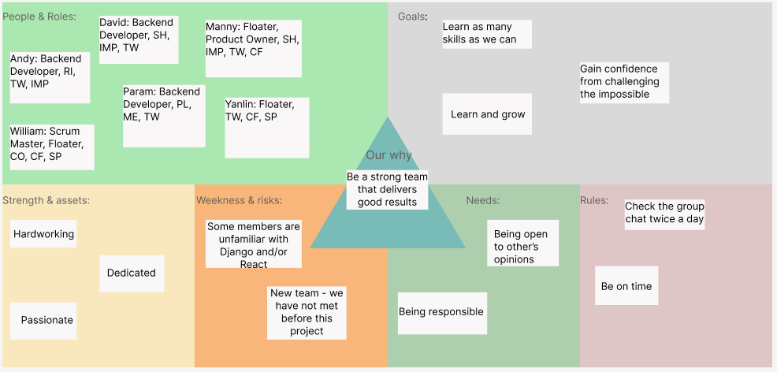

# Teamwork

This page provides an overview of the team and its members.

## Team Canvas

## Belbin Roles

Source: [https://www.belbin.com/about/belbin-team-roles](https://www.belbin.com/about/belbin-team-roles).

| **Name**       | **Preferred Roles** | **Manageable Roles** | **Least Preferred Roles** |
| -------------- | ------------------- | -------------------- | ------------------------- |
| Zhixuan        | PL, TW, RI          | IMP, SP, CF          | ME, SH, CO                |
| William        | TW, CF, SP          | IMP, PL, CO          | SH , ME, RI               |
| Yanlin         | TW, SP, CF          | CO, SH, PL           | ME, IMP, RI               |
| David          | IMP, TW, SH         | CO, RI, CF           | PL, ME, SP                |
| Emmanuel       | IMP, CF, SP         | ME, TW, RI           | CO, SH, PL                |
| Param          | PL, ME, TW          | IMP, SP, CO          | SH, RI, CF                |

## Scrum Roles
| **Name**       | **Scrum Roles**     | 
| -------------- | ------------------- | 
| William        | Scrum Master        |
| Emmanuel       | Product Owner       |

### Thinking Roles

#### PL (Plant)

> Tends to be highly creative and good at solving problems in unconventional ways.

1. Param Hooda(preferred)

#### ME (Monitor Evaluator)

> Provides a logical eye, making impartial judgements where required and weighs up the team's options in a dispassionate way.

1. Param Hooda (preferred)

#### SP (Specialist)

> Brings in-depth knowledge of a key area to the team.

1. Yanlin (preferred)
2. William (preferred)

### Action Roles

#### SH (Shaper)

> Provides the necessary drive to ensure that the team keeps moving and does not lose focus or momentum.

1. David (preferred)
2. Emmanuel (least preferred)

#### IMP (Implementer)

> Needed to plan a workable strategy and carry it out as efficiently as possible.

1. Emmanuel (preferred)
2. David (preferred)
3. Zhixuan (manageable)

#### CF (Completer Finisher)

> Most effectively used at the end of tasks to polish and scrutinise the work for errors, subjecting it to the highest standards of quality control.

1. Yanlin (preferred)
2. William (preferred)
3. Emmanuel (preferred)

### People Roles

#### RI (Resource Investigator)

> Uses their inquisitive nature to find ideas to bring back to the team. 

1. Zhixuan (preferred)

#### TW (Teamworker)

> Helps the team to gel, using their versatility to identify the work required and complete it on behalf of the team.

1. Zhixuan (preferred)
2. Yanlin(preferred)
3. Emmanuel(preferred)
4. David(preferred)
5. Param Hooda(preferred)

#### CO (Co-ordinator)

> Needed to focus on the team's objectives, draw out team members and delegate work appropriately.

1. William (manageable)